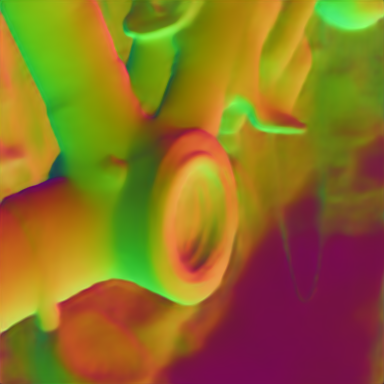
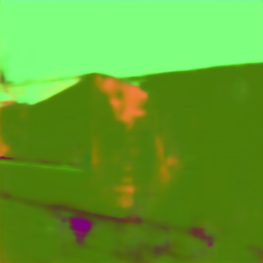

# 3D Common Corruptions and Data Augmentation [CVPR 2022, Oral]

This repository contains tools for benchmarking and training computer vision models using 3D Common Corruptions (3DCC):

- [Demo code](#quickstart-for-generating-3dcc)
- [Live demo](https://3dcommoncorruptions.epfl.ch/#livedemo) 
- [Generating corruptions](#details-on-generating-individual-corruptions)
- [Training scripts](#training-with-3d-data-augmentation)
- [Pretrained models](#pretrained-models) [**\*Version 2 Models (stronger than V1)\***]
- [Data](#3dcc-data)
- [ImageNet-3DCC & COCO-3DCC](#extending-3dcc-to-other-datasets)
- [Docker and installation instructions](#installation)

for the paper: [**3D Common Corruptions and Data Augmentation**](https://3dcommoncorruptions.epfl.ch/).

[](https://3dcommoncorruptions.epfl.ch)

<table>
<tr><td><em>
Above: Using 3D information to generate real-world corruptions.
The top row shows 2D corruptions applied uniformly over the image, e.g.
as in Common Corruptions, disregarding 3D information. This leads
to corruptions that are unlikely to happen in the real world, e.g. having the
same motion blur over the entire image irrespective of distance from camera (top left). Middle row shows their 3D counterparts from 3D Common
Corruptions (3DCC). The circled regions highlight the effect of incorporating 3D information. More specifically, in 3DCC, 1. motion blur has a
motion parallax effect where objects further away from the camera seem
to move less, 2. defocus blur has a depth of field effect, akin to a large
aperture effect in real cameras, where certain regions of the image can be
selected to be in focus, 3. lighting takes the scene geometry into account
when illuminating the scene and casts shadows on objects, 4. fog gets
denser further away from the camera, 5. occlusions of a target object, e.g.
fridge (blue mask), are created by changing the camera’s viewpoint and
having its view naturally obscured by another object, e.g. the plant (red
mask). This is in contrast to its 2D counterpart that randomly discards
patches.
</em></td></tr>
</table>

---

Table of Contents
=================

   * [Introduction](#introduction)
   * [Installation](#installation)
   * [Quickstart for generating 3DCC (demo code)](#quickstart-for-generating-3dcc)
   * [Generate corruptions in 3DCC](#details-on-generating-individual-corruptions)
   * [Quickstart for training (demo code)](#quickstart-for-training-with-3d-data-augmentation)
   * [Download all pretrained models](#pretrained-models)
   * [Train a model using 3D data augmentation](#training-with-3d-data-augmentation)
   * [Data](#3dcc-data)
   * [Citing](#citation)


## Introduction
**Robustness problem:** Computer vision models deployed in the real world will encounter naturally occurring distribution shifts from their training data. These shifts range from lower-level distortions, such as motion blur and illumination changes, to semantic ones, like object occlusion. Each of them represents a possible failure mode of a model and has been frequently shown to result in profoundly unreliable predictions. Thus, a systematic testing of vulnerabilities to these shifts is critical before deploying these
models in the real world.

**A new set of realistic corruptions:** This work presents a set of distribution shifts in order to test models’ robustness. In contrast to previously proposed
shifts which perform uniform 2D modifications over the image, such as Common Corruptions (2DCC), our shifts incorporate 3D information to generate corruptions that are
consistent with the scene geometry. This leads to shifts that are more likely to occur in the real world (See above figure). The resulting set includes 20 corruptions, each representing a distribution shift from training data, which we denote as 3D Common Corruptions (3DCC). 3DCC addresses several aspects of the real world, such as camera motion, weather, occlusions, depth of field, and lighting. Figure below provides an overview of all corruptions. As shown in the above figure, the corruptions in 3DCC are more diverse and realistic compared to 2D-only approaches.

**Use cases of 3DCC:** 
1) We show in the paper that the performance of the methods aiming to improve robustness, including those with diverse data augmentation, reduce drastically under 3DCC. Furthermore, we observe that the robustness issues exposed by 3DCC well correlate with corruptions generated via photorealistic synthesis. Thus, **3DCC can serve as a challenging test bed for real-world corruptions**, especially those that depend on scene geometry.
2) Motivated by this, our framework also introduces **new 3D data augmentations**. They take the scene geometry into account, as opposed to 2D augmentations, thus enabling
models to build invariances against more realistic corruptions. We show that they **significantly boost model robustness** against such corruptions, including the ones that cannot be addressed by the 2D augmentations.
3) The proposed corruptions are **generated programmatically with exposed parameters**, enabling fine-grained analysis of robustness, e.g. by continuously increasing the 3D
motion blur. The corruptions are also **efficient** to compute and can be computed on-the-fly during training as data augmentation with a small increase in computational cost. They
are also **extendable, i.e. they can be applied to standard vision datasets, such as ImageNet, that do not come with 3D labels.**


### An overview of the corruptions

We propose a diverse set of new corruption operations ranging from defocusing (near/far focus) to lighting changes and 3D-semantic ones, e.g. object occlusion.

[](https://3dcommoncorruptions.epfl.ch)


### Extending 3DCC to other datasets

As mentioned before, 3DCC can be applied to most datasets, even those that do not come with 3D information. Several query images from the ImageNet and COCO dataset are shown below with near focus, far focus and fog 3D corruptions applied. Notice how the objects in the circled regions go from sharp to blurry depending on the focus region and scene geometry. To get the depth information needed to create these corruptions, predictions from [MiDaS](https://github.com/isl-org/DPT) model is used. This gives a good enough approximation to generate realistic corruptions (as also analyzed in the paper). 

[](https://3dcommoncorruptions.epfl.ch)

We provide the depth data used to corrupt ImageNet and COCO images with 3DCC in [this section](#3dcc-data).


## Quickstart for generating 3DCC

To obtain images corrupted with 3DCC:
```bash
cd create_3dcc
python create_3dcc_demo.py --path_source '../sample_data' --path_target '../sample_data/rgb_3dcc' --batch_size 50
```

This uses sample RGB and 3D data [here](https://github.com/ofkar/3DCommonCorruptions/tree/main/sample_data) to apply corruptions. The resulting images are saved [here](https://github.com/ofkar/3DCommonCorruptions/tree/main/sample_data/rgb_3dcc). We define five shift intensities (or severities) for the corruptions to test model robustness. See examples below:

[](https://3dcommoncorruptions.epfl.ch)


## Details on generating individual corruptions

It is also possible to generate corrupted images for individually selected corruption types. For this, you can browse [this folder](https://github.com/ofkar/3DCommonCorruptions/tree/main/create_3dcc) and use the corresponding function. For example, if you want to generate 3D Fog data, check the corresponding script [create_fog.py](https://github.com/ofkar/3DCommonCorruptions/blob/main/create_3dcc/create_fog.py#L90) which has the following function:

```bash
def create_fog_data(BASE_PATH_RGB=None, BASE_PATH_DEPTH=None, BASE_TARGET_PATH=None, BATCH_SIZE=1):
    ....
```
Then you can pass the required arguments to indicate location of your clean images and their corresponding depth, path to save images, and batch size. Similar process can be performed for other corruption types too, namely:
```bash
create_dof.py # Near/Far Focus
create_flash.py #Flash
create_fog.py #Fog 3D
create_multi_illumination.py #Multi-Illumination
create_shadow.py #Shadow
create_non3d.py # Low-light Noise, ISO Noise, Color Quantization
```

For semantic corruptions, i.e. occlusion and scale, you can run the following commands:

```bash
cd create_3dcc/semantics/
./generate_amodal_masks.sh 1 fridge  # for an example of occlusion corruption
./generate_amodal_masks.sh 2 sofa    # for an example of scale corruption
```


Note: We recommend using the docker image provided in Omnidata [repository](https://github.com/EPFL-VILAB/omnidata-annotator#installation) to generate semantic corruptions. 

    
## Quickstart for training with 3D data augmentation

#### Download the trained networks
We release the [pretrained models](#pretrained-models) used for the demo. They can be downloaded with the following command:
```bash
sh ./tools/download_models.sh
```

This downloads the UNet and DPT models trained on Taskonomy (T+UNet and T+DPT) and DPT models trained on Omnidata with and without 3D data augmentation (O+DPT and Ours) for surface normals prediction task to a folder called `./models/pretrained_models_3dcc`. Individual models can be downloaded [here](https://drive.switch.ch/index.php/s/GB1vhCT1ujgjxks).

#### Run a model on your own (clean) image

To run the pretrained models on a set of sample images:

```bash
python demo.py --task normal --img_path ./sample_data/demo_in/ --output_path ./sample_data/demo_out/
```

This script returns predictions for the sample images [here](https://github.com/ofkar/3DCommonCorruptions/tree/main/sample_data/demo_in) and saves them [here](https://github.com/ofkar/3DCommonCorruptions/tree/main/sample_data/demo_out) for all models. 

Input      |T+UNet                     |T+DPT                             |O+DPT                              |Ours
:--------------------------:|:--------------------------:|:--------------------------:|:--------------------------:|:-----------------------------:
    |    |     |     | 
  |  |   |   |  
  |  |   |   |  
  |  |   |   |  
  |  |   |   |  
  |  |   |   |  
  |  |   |   |  

If you want to train (or finetune) models using 3D data augmentation, see [training](#training-with-3d-data-augmentation) for instructions.


## Pretrained models

#### (**\*New\***) Download the version 2 models
You can download our latest pretrained depth and surface normal models [here](https://docs.omnidata.vision/pretrained.html#Pretrained-Models). 
For a live demo of these models on user uploaded images, please visit [here](https://omnidata.vision/demo/).

In case you use these pretrained models please cite the following papers:

* [3D Common Corruptions and Data Augmentation](https://github.com/EPFL-VILAB/3DCommonCorruptions#citation)
* [Omnidata: A Scalable Pipeline for Making Multi-Task Mid-Level Vision Datasets From 3D Scans](https://github.com/EPFL-VILAB/omnidata/tree/main/omnidata_tools/torch#citation)


#### Network Architecture
All networks are based on the [UNet](https://arxiv.org/pdf/1505.04597.pdf) and [DPT](https://arxiv.org/abs/2103.13413) architectures and trained on [Taskonomy](https://openaccess.thecvf.com/content_cvpr_2018/html/Zamir_Taskonomy_Disentangling_Task_CVPR_2018_paper.html) and [Omnidata](https://openaccess.thecvf.com/content/ICCV2021/html/Eftekhar_Omnidata_A_Scalable_Pipeline_for_Making_Multi-Task_Mid-Level_Vision_Datasets_ICCV_2021_paper.html) datasets. Please see the paper for additional training details. Architectures for the models are given [here](https://github.com/ofkar/3DCommonCorruptions/tree/main/models).


#### Download the version 1 models
The following command downloads the pretrained models.
```bash
sh ./tools/download_models.sh
```

This downloads the UNet and DPT models trained on Taskonomy and DPT models trained on Omnidata with and without 3D data augmentation for surface normals prediction task to a folder called `./models/pretrained_models_3dcc`. Individual models can be downloaded [here](https://drive.switch.ch/index.php/s/GB1vhCT1ujgjxks).


## Installation 

There are two convenient ways to run the code. Either using Docker (recommended) or using a Python-specific tool such as pip, conda, or virtualenv.

#### Installation via Docker [Recommended]

We provide a docker that contains the code and all the necessary libraries. It's simple to install and run.
1. Simply run:

```bash
docker run --runtime=nvidia -ti --rm andrewatanov/3dcc:latest
```
The code is available in the docker under the `/3DCommonCorruptions/` directory, and all the necessary libraries should already be installed in the docker (you might need to update pytorch if you use A100).

#### Installation via Pip/Conda/Virtualenv
The code can also be run using a Python environment manager such as Conda. See [requirements.txt](./tools/requirements.txt) for complete list of packages. We recommend doing a clean installation of requirements using virtualenv:
1.  Clone the repo:
```bash
git clone https://github.com/EPFL-VILAB/3DCommonCorruptions.git
cd 3DCommonCorruptions
```

2. Create a new environment and install the libraries:
```bash
conda create -n testenv -y python=3.6
source activate testenv
pip install -r tools/requirements.txt
apt-get update && apt-get -y install libmagickwand-dev && apt-get -y install libgl1-mesa-glx
apt install ffmpeg
```


## Training with 3D data augmentation

Our training script is based on [Omnidata](https://omnidata.vision/) repository. To train a DPT model for surface normals using L1 and cosine angular losses:
```bash
cd train
python train_normal.py --gpus 1 --val_check_interval 3000 --limit_val_batches 100 --max_epochs 800 --precision 32 --lr 1e-5 --lr_step 1000 --batch_size 8 --image_size 384 --num_workers 32 --experiment_name EXPNAME
```

Similarly, to train a depth prediction model, run:
```bash
cd train
python train_depth.py --gpus 1 --val_check_interval 3000 --limit_val_batches 100 --max_epochs 800 --precision 32 --lr 1e-5 --lr_step 1000 --batch_size 8 --image_size 384 --num_workers 32 --experiment_name EXPNAME
```

Please see Omnidata [documentation](https://docs.omnidata.vision/training.html) for more details. 

We recommend using precomputed depth and lighting (e.g. reshading) images when available to reduce the computational overhead during training. Similarly, the augmentations can be applied on GPU to improve training speed. If memory becomes an issue in that case, you can move some augmentations to CPU. 

## 3DCC Data 

3DCC data can be accessed from [here](https://datasets.epfl.ch/3dcc/index.html).

To download ImageNet-3DCC, simply run:
```bash
sh ./tools/download_imagenet_3dcc.sh
```
The images will be saved to `./ImageNet-3DCC` folder.

## License

This project is under the CC-BY-NC 4.0 license. See [LICENSE](https://github.com/EPFL-VILAB/3DCommonCorruptions/blob/main/LICENSE) for details.

## Citation

If you find the code, models, or data useful, please cite this paper:

```
@inproceedings{kar20223d,
  title={3D Common Corruptions and Data Augmentation},
  author={Kar, O{\u{g}}uzhan Fatih and Yeo, Teresa and Atanov, Andrei and Zamir, Amir},
  booktitle={Proceedings of the IEEE/CVF Conference on Computer Vision and Pattern Recognition},
  pages={18963--18974},
  year={2022}
}
```

